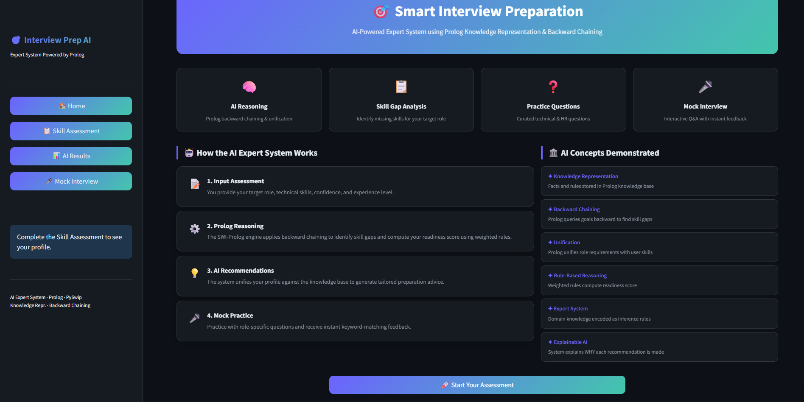

# SmartPrep AI: A Logic-Based Interview Readiness System

SmartPrep AI moves away from generic interview prep to create a tool that actually reasons through a candidate's profile. It is a hybrid Expert System that uses symbolic logic to identify specific skill gaps and provide a quantified readiness score for tech roles like Software Engineering and Data Science. Unlike standard apps that use simple databases, this system uses a Prolog-based inference engine to implement Explainable AI (XAI), ensuring every recommendation is based on deterministic rules rather than probability.

The backend uses Backward Chaining to verify if a user's skillset matches a target role's requirements. If a skill is missing, the system uses Negation-as-Failure to flag it as a gap and then uses Unification to pull specific study resources from the knowledge base. This ensures that the feedback provided is a logical conclusion derived directly from the requirements of the job market.

| Home Dashboard | Readiness Analysis |
| :---: | :---: |
|  |  |

| AI Recommendations | Analysis Results |
| :---: | :---: |
|  |  |

### System Functionality

The application uses a modular architecture that separates symbolic reasoning from the presentation layer:

* Analyzes user profiles against role-specific requirements stored in a Prolog knowledge base.
* Computes readiness scores using weighted rules that factor in skill priority, experience, and confidence.
* Generates natural language justifications for every assessment result via an Explainable AI module.
* Conducts mock interviews with real-time feedback using keyword-based conceptual evaluation.

### Project Structure

```text
.
├── app.py
├── assets/
│   └── styles.py
├── data/
│   └── questions.json
├── prolog/
│   └── knowledge_base.pl
└── utils/
    ├── helpers.py
    ├── prolog_engine.py
    └── question_bank.py
```

### Setup and Installation

This project requires SWI-Prolog to be installed on your system and added to your PATH for the Python-Prolog bridge to function correctly.

1. Clone the repository:
```bash
git clone https://github.com/yourusername/smartprep-ai.git
cd smartprep-ai
```

2. Install the necessary Python libraries:
```bash
pip install pyswip streamlit swiplserver
```

3. Launch the Streamlit dashboard:
```bash
streamlit run app.py
```

### Technologies and References

The development of this system was supported by several core technologies and logic programming principles:

* **SWI-Prolog**: The primary engine for symbolic reasoning and backward chaining.

      Link: https://www.swi-prolog.org/

* **PySwip**: A Python library that allows the application to query the Prolog knowledge base.

      Link: https://github.com/yuce/pyswip

* **Streamlit**: The framework used to build the interactive web dashboard and UI.

      Link: https://docs.streamlit.io/

* **Explainable AI (XAI)**: Theoretical framework used to ensure system transparency and rule-based traceability.
